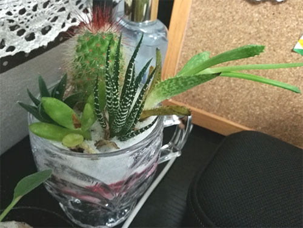

标题有点噱头，其实并不是要讲什么感天动地的励志故事。    

最近又找到了一些能够解释为什么做事情一定要注重持之以恒的理由。  
很简单，你不坚持，前面的所有努力可能全都白费了。这对于自己而言简直太残忍了好吗。这么残忍的事实，一定要有一个及早的认识才好。  
举个例子，比如说减肥，你减一段时间就打算终止一下，又开始放肆地和以前一样乱吃，很快反弹了回来。那么前面辛辛苦苦跑了那么几百几千公里的路，全都废了。流的那么多汗，花了那么多时间，在线听了那么多燃曲（计算一下相当于消耗掉每个月一百多块的流量费），那么多的辛苦，全都废掉了，你耗在减肥上的那段人生简直就可以说一点意义都没有。  

发散一下。在如今这个信息爆炸时代，人的注意力太容易被分散了，假如你的一生就这么被一边分散着，一边消耗着，一边又似乎一直在辛勤努力着，假如唯一的价值就是为了以后总结的时候发现，哇我前面的那段时间，那段人生，都废掉了。那多可惜。  
人生倘若被这么消耗，多么遗憾。  

我现在我就觉得我很危险。    

今天看到种的仙人掌里挂掉了一棵长劲比较猛的。 
  
给我两个启示。  
一是，即使是仙人掌，过了一定的时间，我不坚持给它浇水，它一样会死掉。那意味着他长得那么大，基本意义为零。当然它也进行了一些光合作用，也不能完全说意义为零，但是无疑，它的生命走到了尽头，这断送了未来它继续创造价值的所有可能性。然而从仙人掌的角度而言，它一直是在努力着生存，和发挥价值。另一个角度，作为养它的人，假如说我养仙人掌的目的就是为了看到它开花的那一天的话，那就可以说，这个仙人掌生长到现在，我付出的努力算是白费了。  
另一个启示是，懂得随机应变，也许可能会走得更长久。不一定一直十分卖命地努力，才是最好的。  
就像这个仙人掌，其实，同一盆里面还有其他种类的仙人掌，但是他们才看上去都活得很好，没有死掉。  
因为主人特别懒，浇水基本上一个月也就那么一两次，其他的植物长得特别慢，看上去这一株长得特别快的吸收了最多的养分，貌似其他的植物好像吃亏了一样。然而实际上，最终证明这是一件非常可怕的事情，因为假如主人有一次浇水的时间更长的话，这一株长得最旺的吸收养分最频繁和最多的植物会先死掉，有非常大的可能抵抗不了这次“寒冬”（事实就是这么不幸）。
不过其实我觉得这个启示也没啥可比性。人的随机应变能力相较于植物显然是没有半毛钱可比性，并且人不能因为惧怕寒冬，就停止吸收养分的速率。不过要说枪打出头鸟的老道理的话倒是能挂上钩。总觉得个中应该还有什么更深的玄机啊。。。  
好吧，这个鸡汤烹饪失败。看到这里的小伙伴假如有其他感想的话欢迎交流沟通。

最近从学习上吸收的教训特别多。  
人大多数时候学一门知识是为了应用。然而，很多必须通过结构主义方法学习和掌握的知识，只做一些断断续续的学习，甚至动不动中途放弃，是达成不了任何价值的。比如说前段时间我在看一本Javascript的书，看的时候，投入很多精力和时间，也觉得收获了很多，但是仅仅隔了两个多月没继续看，我就发现再重新拿起的时候，前面的很多东西都要再花时间好好复习一下。  
这还是比较好的情况。  
继续想一想，我长那么大以来学过的那么多那么多现在根本就没有用到的知识，这在这样一个知识爆炸的信息时代，是多么可怕的一件事情。举个例子，比如说文言文。如果说，它能陶冶人的情操的话，我觉得至少对我个人而言，这个目的没有达到，我学它的时候是极端痛苦的，并且完全没有兴趣。我当然是觉得文言文是非常博大精深的，我学的时候经常感叹，竟然能够把一个句子精炼到这样的程度，真的是非常奇巧。  
然而现在我重新反思，我觉得我在文言文上面下的功夫完全是没有意义的，那段时间的人生也算是白白的浪费掉了。  

知识那么多，人生那么短，我不可能掌握所有知识。  
我觉得对于现代人而言的一个必须的基本技能就是，要学会判断哪些是没有必要获取的知识和信息。  

并不是说一件事情，没有现实的意义（应用价值），就不应该去做。相反我觉得对于一个人而言，感兴趣的东西，即使花非常多的时间做出来也没有什么价值，也没有关系。但是万万不能忘记坚持的重要性，浪费生命总是不好的，即使是出于兴趣去学习某样东西。  
比如说学架子鼓、学漂移板、学英语。工作的时候，这些东西的学习就变得次要了，经常容易忘掉。一时半会儿不去想，会觉得没什么并不算什么大事儿，但是时间一长了。这些潜在的损失就会变得十分巨大。不是因为你损失了这段时间本应该补充学习的内容，而是因为，由于人类大脑的遗忘特性，你曾经辛苦掌握的那部分正在变得虚无。过了很长一段时间，你突然想起来，想重新把它们拿起来的时候，会发现很多你曾经会的东西竟然都不会了。这意味着，很多你曾经花了很多时间和金钱去学习和掌握的东西都要从头学一遍。直白地说，就是你曾经的人生中，有那么一段正在变得没有意义。换种方式而言，你整体的生命中有那么一部分变得没有意义。  

然而既没有兴趣又没有现实意义的事情，真的就不要再浪费时间了。什么长远意义，潜在意义之类的说辞，真的是像毒瘤一样，害人太深。根据奥卡姆剃刀原理，这些潜在的意义以及长远的意义就完全可以视作根本没有意义。比如说你学习法语，要是单纯觉得法语特别美，想了解法语，我觉得花功夫学是很有意义的。但是假如为了学习法语，是要去法国旅游的话，就建议再三考虑一下。因为现在旅游业那么发达，你不学法语，我相信也可以很好的去法国旅游。  

再看看那株仙人掌，虽然，平时看着它好好的没什么，但是超过了那么一段时间点，再看它，它竟然就挂了。  

我怎么会想到它竟然就挂了。    

其实我只不过需要每两周给仙人掌浇那么15毫升的水。这整体耗费的时间大概是两周中的十秒。看起来多么微不足道的时间啊，然而就是因为缺乏继续这件事情的意识，最终导致了这株仙人掌的死亡。作为个体而言，假如我养它的目的是为了看它开花的话，这就意味着我过去有一段人生（给仙人掌浇水的那一段）是失败和没有意义的。  

及时意识到潜在损失是多么重要。对于仙人掌，假如我意识到今天的存在的话，我要么就不应该买它，以避免之后浪费掉的那段人生（虽然只不过n个10秒）要么就应该保持持续给它浇水的习惯。  

我又想起来我大学曾经花了那么多时间学Photoshop。现在虽然基本的技能我还是会的，但是，我曾经花了很多时间学习的炫酷的技能现在都不会了。并且这些技能并没有得到及时的应用，可以说我那段时间的人生基本就是没有意义的。更可怕的是，我为了学习这些即将成为潜在损失的技能耽误了重要的必修学科的深入学习，这个潜在损失不得不说是翻倍的。

现在反思来看，除了对于你决心掌握的东西一定要必死的坚持以外。学一门技能之前一定要考虑好，你耗费在它上面的人生会不会得到实际的应用价值以及它对你而言的意义到底有多少。没有，就千万停住。潜在价值太多了，不明确，就是没有价值。

  