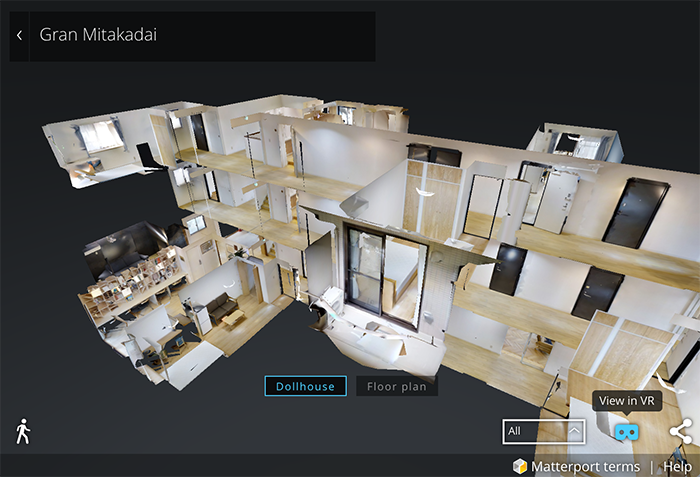

我对谷歌的崇拜又上了一个台阶。  

今天无意中想看看OakHouse这个共同住宅房产公司又有什么新的物件，其实并不是想搬家，我对我住的地方比较满意。纯粹就是想欣赏一下这个公司的其他房子，因为这里的房子都很漂亮，内部布置也很有美感。有的时候能给我很多灵感。  
我随便打开了一个三鹰台地区的物件，一眼就看到了网页里面的一幅立体地图。  

  

于是我就点进各个房间详细查看，尽情徜徉。一边感叹这个立体地图做的真棒，一边注意到右下角的一个眼镜形状的按钮，"View in VR"。我突然想起来放在柜子上蒙了一年灰的VR眼镜，当时带了玩了半个多小时游戏，有点头晕想吐，于是就一直扔在那边。顺着好奇心，我按照网站步骤，下载了谷歌的辅助软件。  
按照说明我用VR软件打开了这个立体地图，戴上VR眼镜，就觉得自己像来到了这个住宅里面一样，感觉很是身临其境。向前向后，进入房间，抬头低头，左右旋转，哪个角度，都可以满足你的视觉需要。通过这样的方式体验房子的话，以后真的不用专门跑去看房子了。因为我的VR眼镜不是谷歌出品的，所以不是完全兼容，但体验已足以让我惊奇。可以想象，假如用的是谷歌出品的VR眼镜的话，通过手势应该可以更方便的进行操作。  
后来我又体验了一下谷歌的Matterport VR中的一些展览馆，比如说艺术馆，电脑博物馆等等，除了觉得整个过程是自己一个人在展馆里有点寂寞，以及手机看无可避免的像素硬伤以外，体验真的很不错。  

再次不住感叹科技发展真快呢，在我想努力超在时代前头的时候，说不定已经被时代慢慢丢在后面了呢。  
在一些被我扔到“大脑的橱柜”蒙着灰的技术领域，其实都在默默地以让我震惊的速度如火如荼的发展着呢。等你什么时候想起它了，它竟然几乎长成了完全体，你看到它的时候又惊奇又觉得恐惧，又开心又觉得淡淡的哀伤。  

人工智能也是一样吧，机器人是不是也会什么时候以迅雷不及掩耳的速度替代掉好多职业。不不，其实现在已经在默默进行着呢，你看GU自动收款系统，国内的无人超市…  

突然想起前几天出去跑步的时候，绕过十字路口的转角，发现有一排货运卡车在等红灯。其间有几位司机在趁着等红灯的间隙狼吞虎咽地吃着盒饭。那个时候大概是晚上9点，可以想象还有一夜的辛苦路途在等着他们。略过这个场景，我转过头向着前方继续跑，不由地脑子里一阵难过。过不了多久，自动驾驶汽车就会全部取代司机的职业。这是时代发展的需要，是科技的进步。但是有时候却是高兴不起来。  

革新的过程，总是伴随着几家欢乐几家愁。  

我愿意相信，会有新的职业等着他们，但也许又是一个艰难的过程吧。  
总之，这是需要交给未来的问题。不久的未来。努力做好自己能做的事吧。按照自己的节奏，尽量把握自己的未来。  