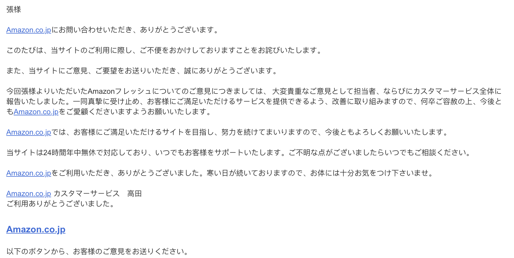

在日本生活第五年了，和日亚结缘也有快四年了。  
从一开始只是在日亚上买一些平日在超市找不到的东西，到现在连便利店都不怎么去了（除非偶尔突然垂涎鸡腿难耐）。  

日常的超市购物也转而被日亚生鲜替代，总结下来有以下好处：
1. 不用跑超市了。
2. 不用事先把想买的东西汇集记在纸上了，平日缺什么就到日亚随时搜出来放到购物车，到周末集中下单，不可能有遗漏。
3. 不用集中花半个小时到1个小时那么久逛超市，费力搜索自己所需的东西了，有时候还经常找不到真是很懊恼的。
4. 不用担心没有男票啦！妈妈再也不用担心我买那么一大堆东西还要拎回家啦，这么多年我真是辛苦了。。。
5. 方便货比三家，价格，口碑，一目了然，基本不会购物失手，在超市买来看起来特别好吃的零食结果一点都不好吃这种失望基本不用再体会。
6. 随时补充生活必需品，日亚的购物车内容是存储在服务器上所以不依赖你的设备存在，任何设备打开日亚都能在原来的基础上补充购物单。
7. 不会买多，不会买重，不会冲动消费，因为一般你只会看到和你搜索相关的东西，类似啤酒和尿布的事件不会发生在你身上了。
8. 后悔了随时删除，真的，有时在实体超市把东西放到购物车之后后悔但因为不方便放回原处勉强下单，现在再也不用担心了。并且日亚生鲜有个比较鬼畜的功能就是即使下单了，也还有相当一段长的时间可以删除商品，或者追加商品。不得不说这个真是非常实用呐！
9. 便宜，便宜，便宜。虽然要最低满6000才免运送费，但日亚的东西真的很便宜，至少绝不会比超市贵（但是毕竟东京各地区物价不统一，我也不好说一定会比所有超市都便宜）。并且往往平日一两周的生活日用品和食品怎么也远超6k了，所以其实这个根本不用担心，毕竟有时两瓶化妆水就达标了。。
10. 所有买的东西都有清晰地记录，方便自己进行购物分析，并且经常买的东西，次数也会被记录在日亚生鲜上，会有一个很方便地自动追加日常购物到购物车功能。买过一次觉得不错但日后忘记名字或不知道在哪儿买的这种事情不会再发生。
11. point point！！我集中什么都在日亚上买，积分简直大满足啊，基本一两个月就能攒够一次生鲜的积分了。

不好的地方也有：
1. 平日逛超市那种琳琅满目的喜悦感，扑鼻的各种便当，面包香，新鲜商品的触感等等都是网上购物无法体会得到的。不过对于推崇理性消费的我而言这些都是次要的，甚至是理性判断的干扰因素。
2. 不一定发最新鲜的商品给你，但会保证和商品说明的保鲜期一致。比如平时买蔬菜包，即使保质期有四天，一般自己买的话也会选择当天产的最新鲜的，但生鲜配送的话可能就给你发生产日期已经过了2天，保质期还有2天的蔬菜。  
   
   
但是但是！这次的生鲜服务我特别不满，到货以前两个小时左右扔给我个邮件，说乳酸菌黑醋没货了所以在本次配送中取消了，但不扣钱请不用担心。  
气得我不行，还得去超市单独买，我说至少你们没货时打个电话或发个邮件给我几个替代品选项！我买的都是必需品，你们一个不发货我就还得跑超市！要你们何用！  

然后不一会回复了：

大致意思如下
<blockquote>
非常抱歉造成不便，感谢您的邮件。 
这次收到的您的对于亚马逊生鲜的意见，被我们的担当者作为一份非常贵重的意见并报告给了客户服务中心的全体人员。他们一同诚恳地接受了您的意见，并会为了提供让顾客您满意的服务而做出改善，请您一定要宽恕我们，请今后也继续爱顾我们，拜托了。 
...(接着各种感谢和承诺)... 
天冷了，还请您注意自己的身体。 
客服中心 高田
</blockquote>

a...太诚恳了，日本人的邮件我总是没辙的。即使只是流程化的回复也是本事了得。  
竟然看了觉得有画面感，仿佛看到了标志式地一字排鞠躬。看了气一会儿就消了。  

应该也是很快会改善的吧。服务行业竞争激烈也是有好处的。嗯。