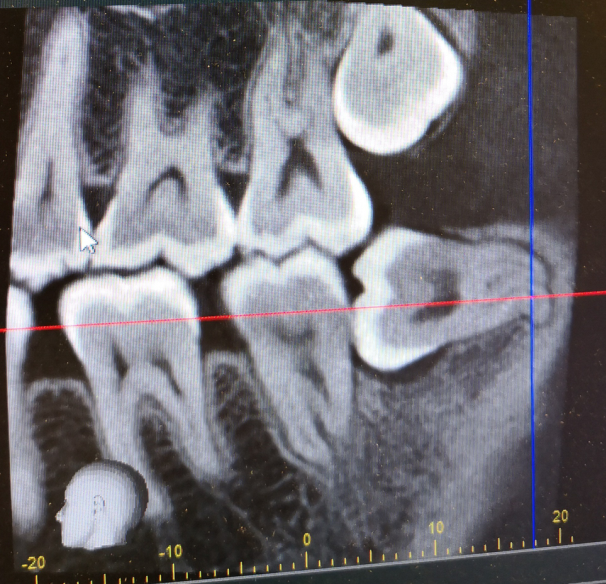
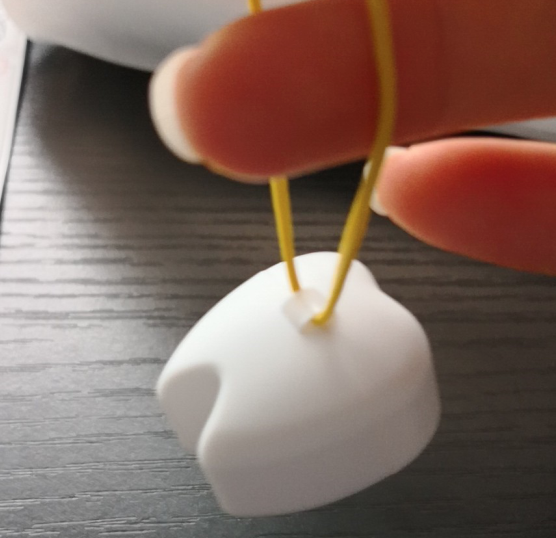

大概是大一开始长智齿，一直长得不温不火，我也就没把它放在心上过。    
时不时会发炎显示一下存在感，但疼到夜里难以入睡的程度的也就那么两三次。   
也算是和我性格比较兼容，于是不知不觉和它共同生活了九年。   

但最近还是决定拔掉它，最主要的原因是这几年吃饭塞牙塞得越来越厉害。   
往往中午吃过饭以后就得去厕所刷牙（我以前是从没有这个习惯的，在我觉得一天早晚两次刷牙已经足够，人体的唾液本身就有很厉害的杀菌消毒作用，刷得次数多了很没必要），甚至要用好几个牙签处理齿缝间的饭后残渣。   
小林家的带细毛刷的牙签虽好，长期依赖下来也要算上一笔不小的开销。   

另外不排除我内心有那么一些好奇，我的智齿到底是长得什么形状？   

于是预约了家旁边的牙科。   
不得不提一下牙科医生的颜值是相当的高，并且很年轻，这让我有点担心他的水平（大概是出于脑子里根深蒂固的颜值和智慧无法并存的陈腐观念）。   
第一周拍了片子，x光透视机是一个半圆弧状的宽边机器，伴着音乐围着你的头绕两圈就结束了，期间没有任何感觉。   
 

一共两颗，左下和右下，这是右下的那颗。(其实可以看到上面也长了智齿，但是因为没有冒头所以医生说不用担心。)我的智齿竟然都是完完全全睡着长的。。。这是我没料到的，一直以为可能就是有点歪。   
医生说两颗牙不能同时拔，大概拔了一颗以后需要隔一个月才能拔另一颗，期间尽量用另一边吃饭。   
另外他说，我的智齿稍微有点奇特，末尾有个小勾子一样的形状。可能需要进行一个小时的手术，并且拔了以后会肿的很厉害。。。   
然而我除掉智齿的决心已定，于是很坚定的说，了解了。然后预约了下周拔牙。他给我开了三天的抗生素，以防止牙齿继续发炎。   

第二周周末去拔智齿。   
进了施术间，助理医生问我需不需要毛毯。我悠悠的从包里抽出一条大毛毯，说谢谢，我带了。医生很震惊，说，哦，好厉害！（233，事先工作当然是少不了，说不害怕是骗人的！网上查到可能会流好多汗，所以带了个大毛巾。）   
然后很快就开始了。助理医师给我上身铺上毛巾（手术中为了保证速度有些小工具是直接放到你脖子下面），眼睛蒙上遮光纱布，先是上麻醉，我的右下部分脸在大概五分钟内变得很僵硬，然后医生试探地用金属触碰我的牙齿问有没有感觉，我说没有。于是就开始往牙齿上各种喷消毒杀菌的液体。之后被伸进了小锤子小钳子之类的，敲敲打打，期间几次想咽口水，但是不太舒服，于是努力转移注意力脑补敲打画面，抑制了口腔生理反应。想着如果不是上麻药该有多疼啊，但是麻掉以后，真的除了感觉到敲打的压力，没有任何疼痛。   
很快听到了牙齿裂开的声音，然后上层的一小部分被掰碎了两半钳了出来（医生用了很大的力气，期间我几度担心如果施力方向稍有偏移我的腮会不会被戳个大洞><）。   
手术并不是持续不间断的，中间会进行几次休息，医生还会不断问疼不疼，疼的话就举手。中间我尝试说一声“ありがとうございます。(谢谢)”但是发出来的声音十分奇妙。。。还好医生和助理貌似都识别出了声音的意思，哈哈笑了起来。   
虽然一直在进行奇奇怪怪的脑补，但是手术貌似很顺利。剩下的一大部分牙齿开始松动，医生自言自语地说，“貌似能行？”，然后就感受到伴着一股渐渐变大的力量我的牙被猛地嵌了出来！（虽然真的是没有感到什么疼痛但是还是从眼睛遮光纱布的缝隙下看到自己倔强的智齿血淋淋地牺牲了，裹着一圈牙龈周围的肉。场面令人心情复杂。如果不是打了麻药得有多疼啊！）   

之后貌似被缝了四针，再喷了一些消炎药，咬住一大块止血棉球大概一两分钟（看到网上说要20几分钟，但这里的情况真的很短）。然后棉球取出，又喷了点药剂，就结束了。比预期的快很多，全程也就半小时。结束以后也没有任何不舒服，更没有流汗。   

结束后和医生要了牙齿想做纪念，医生建议说牙齿留一阵子可能会变得味道很大，建议还是要扔掉的，我说一定扔掉。然后就得到了一个装着我牙齿的小盒子（真可爱！）。   
     

之后医生说现在虽然不疼但是麻药失效以后会变得很疼。并且脸可能会变得很肿，持续几周。      
另外拔完牙不能使劲漱口，尽量要用左边吃饭。不要剧烈运动等等。   
医生开了三天的消炎药和止痛药。   

但是之后到家麻药消了以后只是觉得稍微疼了一小会，就不怎么疼了，于是下厨房做了一顿大餐用左半边牙解决了。拔完牙貌似胃口更好了，还顺便吃了一堆零食，不知道是不是吃得太猛了，期间牙洞上缝的线掉下来一截。。。于是收敛了一些。不过还是没有觉得疼痛。   
并且之后的两天脸也是完全没有发生任何肿胀。事实证明这个明明可以靠颜值的医生技术也还是很不错的？   

但是还是很好奇，为什么脸没有肿起来，检索了一下发现：   
<blockquote>
横向きに埋まって生えている場合、歯茎を切開するのでそれを縫合する必要があります。   
<b> 横向生长的智齿，因为要切开齿根所以需要缝合。</b>     
その際、傷口を完全に閉じるように縫合するか、少しだけ隙間を作って縫合するかで腫れ方が異なってきます。    
<b> 这时，采取把伤口完全缝合或者保留一点缝隙进行缝合的方式，肿胀的情况也不尽相同。</b>        
傷口を完全に閉じると、抜歯したところから出る血液やリンパ液が流れる場をなくし、鎖骨あたりまで腫れてくることがあります。     
この縫合方法は口腔外科出身の医師の間ではスタンダードであり、抗生剤の服用量が少なく、消毒は軽いうがいで済むのが特徴です。が、腫れは大きいと言えるでしょう。       
<b>把伤口完全缝合，阻止了从牙齿拔掉的地方产生的血液和淋巴液的流出，所以有可能会产生一直肿到锁骨的情况。</b>    
<b>这种缝合方法在口腔外科一生中是比较标准的处理方法，只需要服用少量的抗生素，消毒也只需要轻微漱口就可以完成。但是，肿胀可以说是很厉害。</b>  
一方、少しだけ隙間を開けていれば、そこから血液やリンパ液が循環するので腫れは上記の方法よりは多少なりとも少ないことは容易に想像できます。       
<b>又或者，稍微留一点缝隙进行缝合的话，产生的血液和淋巴液就可以得到循环，很容易想象这样就比上面方法的肿胀的程度轻很多。</b>     
その代わり、傷口からの感染症を防ぐためにかなりの量の抗生剤を服用しなければならないこと、また消毒をご自身でもこまめにしなければならないことがデメリットといえます。      
<b>然而作为代价，为了防止伤口的感染症，就需要使用相当量的抗生素，并且自身也不得不认真地做消毒也可以说是一个缺点。</b>     
</blockquote>

照镜子仔细观察了一下，发现果然牙齿那里的空洞是没有被完全缝合的。。。所以这次医生给我使用的是第二种方法啊，也许是担心说了我也不懂所以事先没有跟我解释清楚并让我做选择吧。其实我是希望肿脸的，抗生素什么的还是能少用就少用的说。。。 （￣ー￣；）...   

 
另外，还有一些注意事项：

1.  术后两三小时，麻醉完全消除以后可以进食，但不要吃过热和辛辣的东西。最好是喝粥，煮物等不用咬的东西。（我这次的术后暴食不供参考= =）   

2.  不能用力漱口（拔牙当天最好不要漱口），也不要去舔伤口，或用手指触摸伤口，会妨碍伤口血块结痂，不利于愈合。

3.  诊所开的抗生素要全量用完，中途而废的用法，容易使细菌得到训练而产生抗药性。<b>这是非常危险⚠️的</b>。
在特定的期间服用适宜的浓度的抗生素，可以使抗菌效果有效发挥，可以使细菌全灭而不留生口。但是，中途而废的话，细菌就处于半死不死的状态，根据抗菌力而获得“耐药性”。   

4.  不可饮酒抽烟，不可剧烈运动，不可长时间泡澡（血液循环变的剧烈，容易出血）。   

5.  刷牙的时候避开患处。   

6.  拔牙以后最好要安静地度过。   

 
关于拔完牙以后留下的空洞，和被塞到食物后的处理：   
<blockquote>
傷口を綺麗にしておくために頻繁にうがいをしたり、抜歯後の穴の内部を洗い流そうとすることは治癒を送らせる恐れがあるので逆効果です。    
<b>为了保持伤口清洁而频繁地漱口，对拔牙后的空洞进行内部清洗反而可能会导致无法治愈。</b>  
抜歯後の穴は、正確に説明すると、いきなり穴がふさがって治るのではなく、だんだん穴の底や側面から歯肉が盛り上がってきて、穴が浅く小さくなっていくという経過をとりますので、だんだんと物が詰まったりするのは少なくなっていきますが時間がかかります。 
<b>对于拔牙后的空洞的正确说法是，并非空洞马上就会被填满，而是一个从空洞底下和侧面渐渐长出齿肉，空洞渐渐变浅的过程，这样食物被卡在里面的情况就会渐渐减少，但是需要一定的时间。</b>  
ふさがるまでに食べ物などが入り込んでも、それがそのまま傷に埋め込まれてしまうとかは通常ありませんが、治癒を遅らせる原因になる場合もありますので、うがいなどで取るのが最も良い方法です。 
<b>当空洞被食物卡满，通常也不能放置不管，因为可能会延迟治愈，通过漱口清洁排出卡住的食物是最好的办法。</b>  
あまり無理に触ったりすると、そこから雑菌が入って感染症を引き起こす場合もありますので、気にしすぎずに程度なうがいをこころがけるのが一番でしょう。 
<b>强行触摸的话会使得杂菌进入从而引发感染症，注意经常进行适度而不激烈的漱口是很重要的。</b>  
</blockquote>

拔掉一颗智齿一般要近一个月才能康复。革命尚未结束，这两个月要和智齿奋战到底了。💪